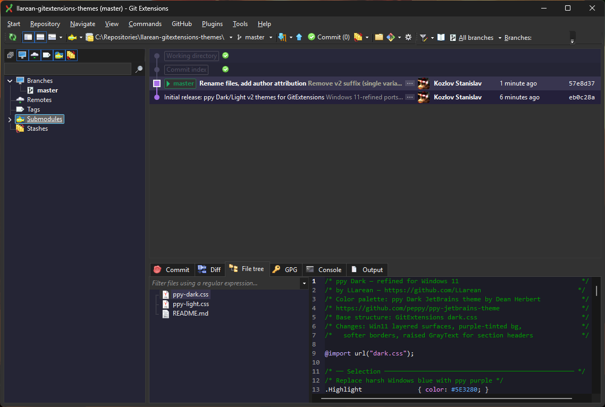
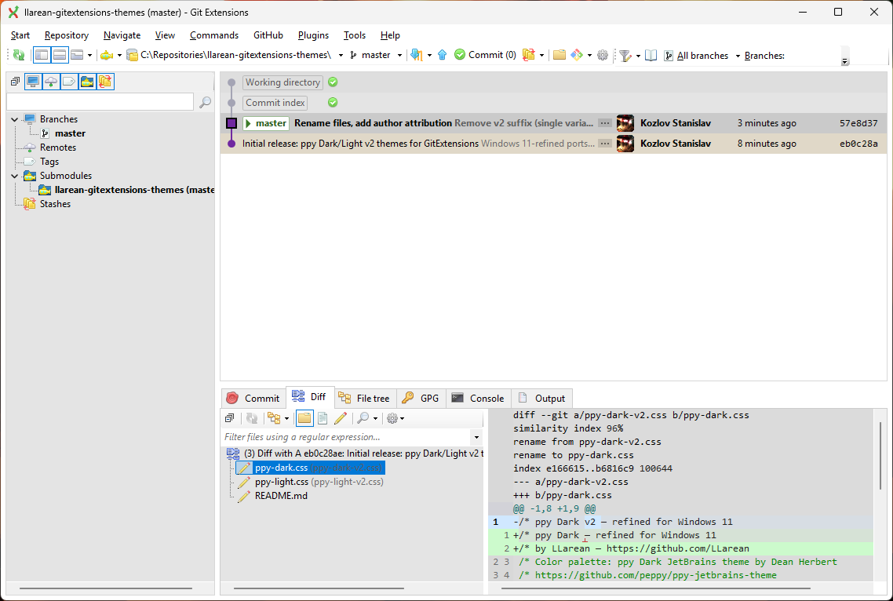

# llarean GitExtensions Themes

Custom themes for [GitExtensions](https://github.com/gitextensions/gitextensions) by [LLarean](https://github.com/LLarean),
based on the [ppy JetBrains theme](https://github.com/peppy/ppy-jetbrains-theme) by Dean Herbert.

Refined for Windows 11 — layered surfaces, softer borders, better contrast.

## Themes

| File | Description |
|------|-------------|
| `ppy-dark.css` | Dark — purple-tinted layered surfaces, Win11 depth system |
| `ppy-light.css` | Light — neutral grey layered surfaces, improved contrast |

## Screenshots

### ppy Dark



### ppy Light



## Installation

1. Copy the `.css` file(s) to:
   ```
   %AppData%\GitExtensions\GitExtensions\Themes\
   ```
2. Restart GitExtensions.
3. Go to **Settings → Appearance → Color theme** and select the theme.

## Attribution

- Color palette: [ppy Dark/Light JetBrains theme](https://github.com/peppy/ppy-jetbrains-theme) by [Dean Herbert (peppy)](https://github.com/peppy)
- Base CSS structure: GitExtensions built-in `dark.css` / `invariant.css`

## License

MIT
